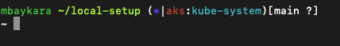

# local-setup

1. Clone repo to your home directory

```bash
git clone https://github.com/mbaykara/local-setup.git
```

2. Append following line to `~/.bash_profile`

```bash
if [ -d ~/local-setup ]; then
   source ~/local-setup/.custom_bash
fi
```

Your promt format:

```
<username><current_directory><curren_kubernetes_cluster><current_namespace><git_branch>
```

Your terminal promp will look as:


